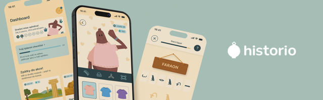
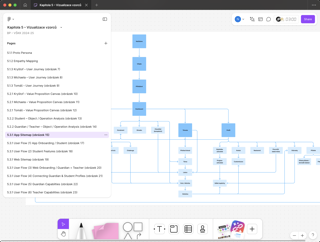
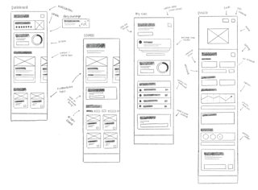

| Project        | Bachelor Thesis                                |
|----------------|-----------------------------------------------|
| Year           | 2025                                          |
| Role           | Research, UX/UI Design, Visual Identity       |
| Tools          | Figma, FigJam, AI-powered design assistance   |
| Output         | High-fidelity prototype, brand system, UX flows, educational content structure |

# Historio: Turning History into a Playground  
**Designing a Mobile App That Makes the Past Click with Generation Alpha**

## They Can Scroll Before They Spell — So Let’s Meet Them There

Generation Alpha doesn't wait. They skip intros, tap twice, and expect results fast. When the classroom went remote, they didn’t panic—they adapted. But while their digital instincts thrived, traditional subjects like history started to fade into the background.

So I asked: 
> What would history look like if it moved at their pace?

Enter *Historio* – a mobile app that transforms history into something swipeable, story-driven, and just a _little_ addictive.

## The Work Before the Work

*Historio* wasn’t just designed – it was co-built with its future users.

To get it right, I started with qualitative research:  
- **Interviews with a school director–parent hybrid and a curious 12-year-old** to capture all the right angles – from the classroom to the kitchen table
- **Custom-designed personas** like Kryštof (the curious 10-year-old who wants to be seen and rewarded)
- **Empathy maps** for three key players: the child, the parent, and the teacher  

Then came the structure:  
- **Value proposition mapping** to define what *Historio* actually solves
- **Object/operation analysis** to map out how the app actually delivers on its promises
- **User journey flows** that charted every click from launch to “lesson complete”  
- **Paper sketches, wireframes, and lo-fi prototypes** tested with real feedback

Into the details? Personas, empathy maps, value proposition canvases, user flows and more – it’s all [here](https://www.figma.com/board/4QUDF1ybLNwOG5XTkKMRLu/Kapitola-5-%E2%80%93-Vizualizace-vzorc%C5%AF?node-id=0-1&t=pedUMNo73xvXrJH6-1), ready to be explored.

The real value of the process? It turned assumptions into insights—and made sure design decisions weren’t just smart, but human.

## What If Learning Felt Like Playing?

Research confirmed what many already knew: kids engage more deeply when they’re in control. They want to choose, collect, personalise – and they love a good “level up.” So instead of static lessons, I designed a system of **micro-missions**: quick, guided journeys through the past, each under 7 minutes.

And the tone? Light but meaningful. Every interaction is a mini moment of discovery.  
Because history deserves more than just bullet points.

## Buttons They Can’t Miss, Feedback They’ll Love

Designing for 9–12-year-olds meant rethinking every tap. Every layout. Every tone of voice.

This resulted in a friendly yet functional visual system – clear typography paired with a warm, focused color palette, modular components built on atomic principles, and microcopy that speaks with encouragement, not instruction.

_Image: Component Library?_ 

### From Flight Path to Field Trip – Inside the Historio Design System

- Dynamic logo and accessible color system  
- Game-inspired learning journeys  
- Tap feedback animations, reward mechanics  
- Dashboard for grown-ups (with just enough charts)  
- Voice and tone guide that speaks kid but earns adult trust

_Image: App Preview (video promo / walkthrough)_ 

But we didn’t stop at kids. Parents and teachers got a supportive web dashboard, built to track progress, unlock extras, and bridge the home–school gap.

_Image: Webiste & Dashboard Preview_ 

## Clap, Wink, Cheer: Testing With Real Kids
Our prototype hit the playground—with real users, real feedback, and real claps (from the app and the kids).

Children loved customizing avatars, unlocking badges, and seeing reactions like character applause or goofy winks after tasks. Parents appreciated the short modules and offline capabilities. Their insights shaped final tweaks—from softer difficulty curves to clearer privacy settings.

## Launching with a Purpose

The idea wasn’t just to build an app – it was to get it into the hands of curious minds.

To support *Historio*’s potential rollout, I developed a strategic promotional framework that reflects how educational products gain trust and visibility—especially among schools and parents.

The approach combined digital reach with real-world visibility:

TBD _Images of OOH, merchandise, geolocation activities and experiential marketing_

The brand’s voice remained consistent: approachable, clever, and always student-first.

---

## Lessons From a Rewritten Timeline

1. **Design for kids = design for trust.** No shortcuts. Every icon, every sound, every word has to earn their attention—and their joy.

2. **Gamification isn’t glitter.** Points are pointless unless they guide learning and reinforce curiosity.

3. **Education is a family thing.** When kids, parents, and teachers all feel seen, the product doesn’t just work—it resonates.

---

Historio taught me that good design isn’t about simplifying—it’s about energizing.  
If history can make kids laugh, wonder, and lean closer to the screen, then maybe—just maybe—we’ve made room for it in their world.
