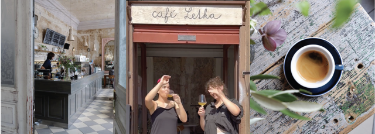

##### Tag: Series of Images that Convey the Café Letka Atmosphere.

---

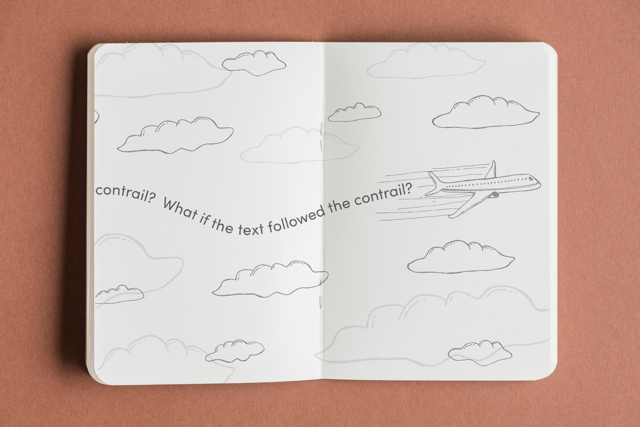

##### Tag: Visualisation of the Initial Idea

---

##### Tag: Detail of Chosen Type – Atyp BL.

###### *Note: Final shape of contrail will be customised to fit between text paragraphs + possibly presented as a marquee.*

---

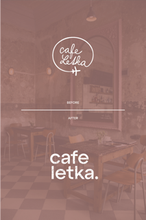
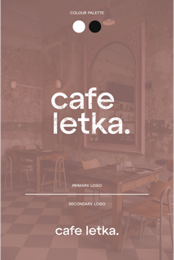

##### Tag: Café Logo Transformation & Key Assets Overview.

###### *Note: Second image appears on hover.*

---

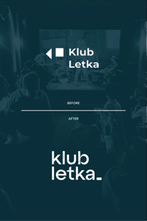
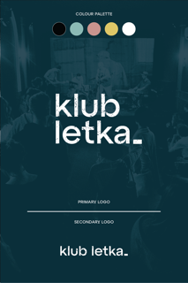

##### Tag: Club Logo Transformation & Key Assets Overview.

###### *Note: Second image appears on hover.*

---

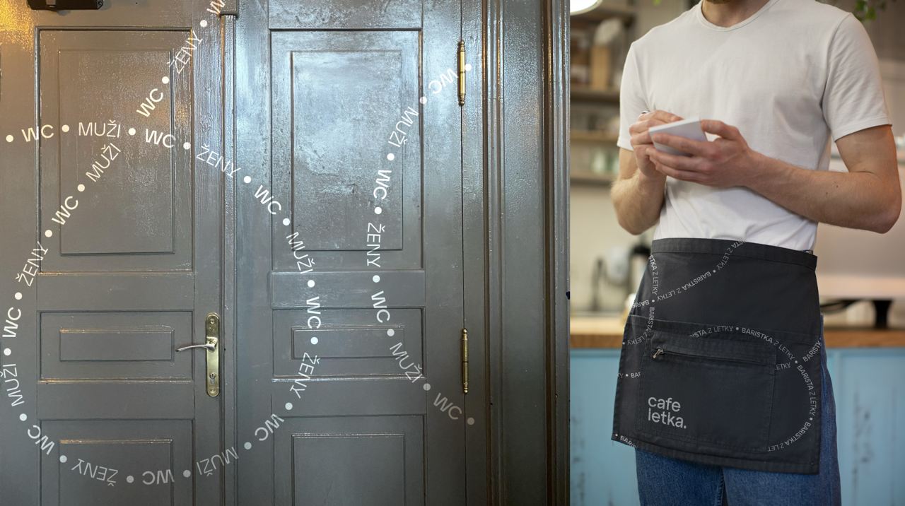

##### Tag: Brand Application on Interior Doors & Aprons.

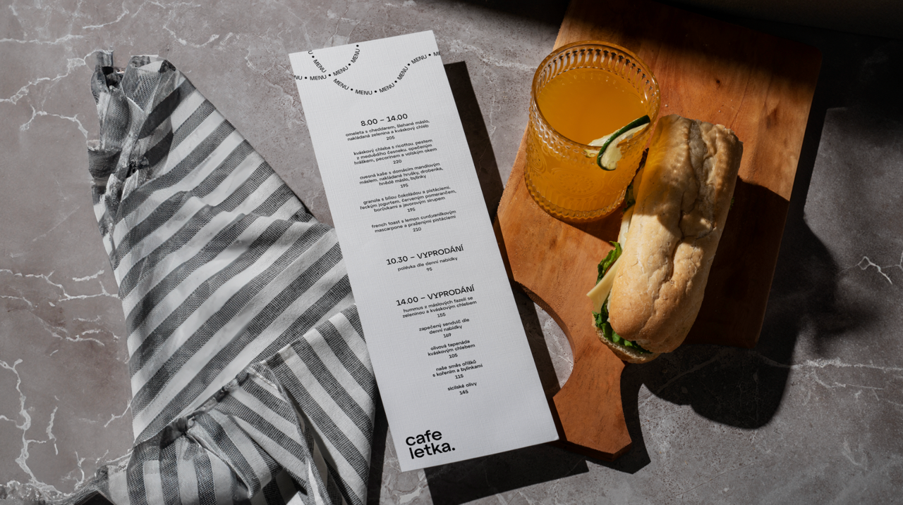

##### Tag: Brand Application on Menu.

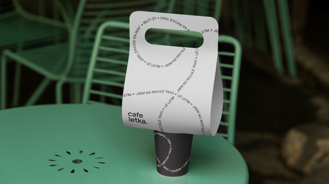

##### Tag: Brand Application on Take Away Cups.

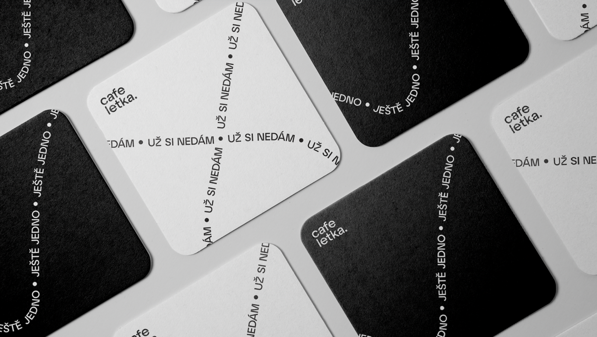

##### Tag: Brand Application on Beer Mat.

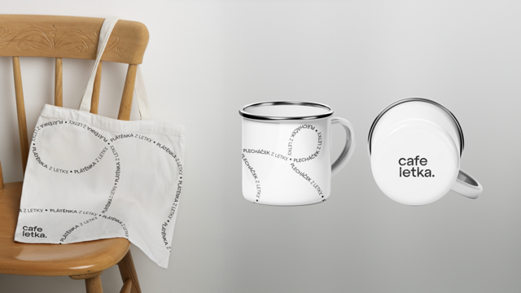

##### Tag: Brand Application on Merchandise – Mugs & Tote Bag. 

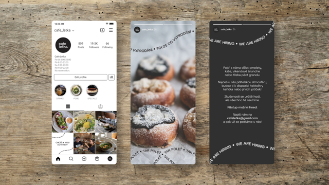

##### Tag: Brand Application on Social Media – Instagram Stories.

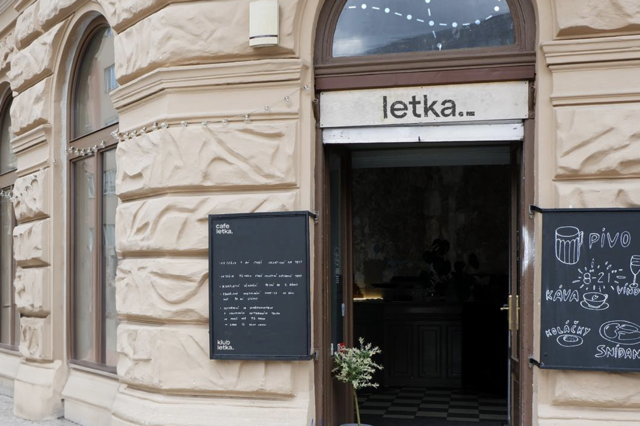

##### Tag: Brand Application on the Exterior Doors – Displays the Combined Logo for the Sister Businesses.

