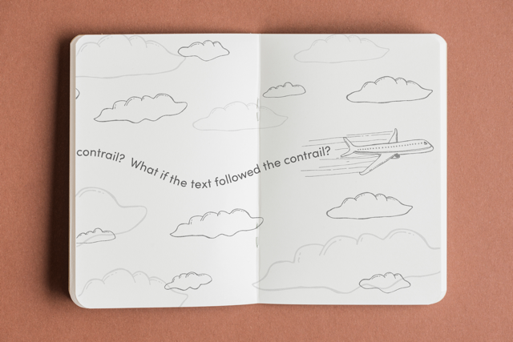
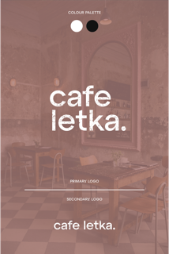
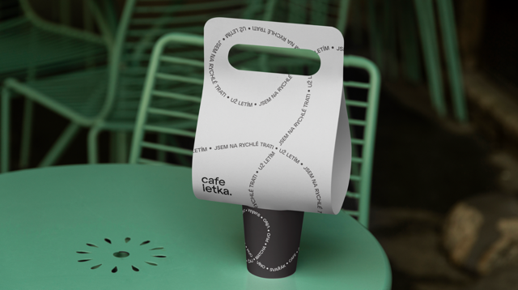
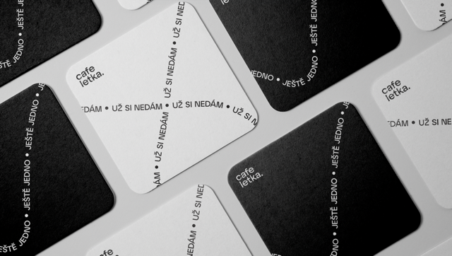
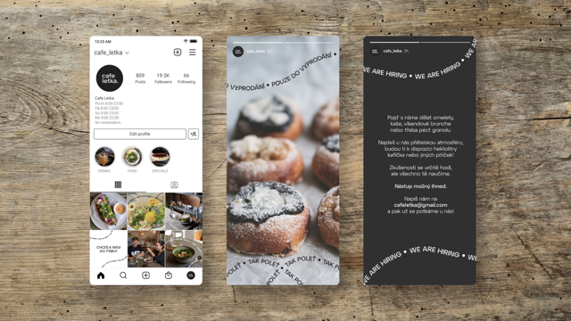

# Café Letka: When Typography Takes Flight

### Aviation Heritage Meets Modern Visual Identity
Coffee is always a great partner in crime, so unsurprisingly, I was excited to make my way to Café Letka, 
nestled near Prague's military aviation museum. Above their entrance hangs the café's logo: a charming hand-drawn 
aeroplane crafted by the owner's daughter. While endearing, this simple emblem faced mounting challenges.

"We're becoming quite a destination," the owner explained during our first meeting. Social media had thrust 
Café Letka into the spotlight, attracting both locals and tourists. Meanwhile, a competitor just a block away 
leveraged similar aviation themes, creating market confusion.

###### Series of Images that Convey the Café Letka Atmosphere.

On site, we discovered another layer of complexity: the adjoining theatre space—Club Letka—operated under the same 
ownership but with a distinctly different purpose. Two connected spaces with disconnected visual identities, both 
competing for recognition in Prague's cultural landscape.

---

### Finding Inspiration in the Skies
I immersed myself in the café environment, observing how patrons moved through the space and how the atmosphere shifted from day to evening when the theatre crowd arrived.

While sketching with coffee in hand, I searched for something more abstract. After all, there must be a way to convey aviation heritage without explicitly emphasising an aeroplane.

Sitting at the airport, heading to London for a six-month stint to gain additional qualifications, inspiration struck: the essence of aviation didn't have to be anchored in the aeroplanes themselves, but in the dynamic, unexpected paths 
they carved through the sky – regardless of make, shape, or size.

I proposed to my team: 
> "What if the letters themselves followed these flight paths?"

###### Visualisation of the Initial Idea.

---

### Typography as the Hero
Typography became the core of our concept, and choosing the right typeface was crucial. Everyone on our team searched 
for something with character but not quirks, distinctive but legible when following invisible flight paths.

After extensive testing, we settled on Atyp BL in confident uppercase. The letterforms, when following our imaginary 
contrails, maintained their integrity while gaining dynamic qualities that static typography couldn't achieve.

###### Detail of Chosen Type – Atyp BL.

A disciplined black and white colour palette kept the focus on the typography's movement without competing elements. For the club's identity, we flipped this approach—vibrant colours filled the dark theatre space, parallel to the life within.

###### Café Logo Transformation & Key Assets Overview.

###### Club Logo Transformation & Key Assets Overview.

---

### From Concept to Reality
Our direction was clear, so it was time to put the concept on paper. This included coffee cups, menus, packaging, 
and signage for the café interior.

The contrails carried straightforward and easily digestible messages, mostly reiterating the item at hand (e.g., 
"menu - menu - menu") or short slogans like "Už letím do Letky," which translates to "I'm flying to Letka"—a phrase 
that sounds far more organic in Czech. We kept these messages short to ensure legibility and accessibility.

---

### The Unexpected Landing
The presentation to the client was met with initial enthusiasm. "It's very well thought out," the owner acknowledged, 
"but perhaps we're looking for our identity to include more organic and free-hand, less structured elements." Despite 
our conversations about how this system would effectively differentiate them from competitors, the client ultimately 
chose a simpler, more logo-centric approach.

###### Brand Application on Interior Doors & Aprons.

###### Brand Application on Menu.

###### Brand Application on Take Away Cups.

###### Brand Application on Beer Mat.

###### Brand Application on Merchandise – Mugs & Tote Bag. 

###### Brand Application on Social Media – Instagram Stories.

###### Brand Application on the Exterior Doors – Displays the Combined Logo for the Sister Businesses.

---

### Learning from Every Flight Path
Though the project didn't land where we hoped, the experience yielded two key insights:

1. **Remote Collaboration:** Managing rigorous work internationally improved my ability to develop meticulous documentation and communication practices that have strengthened all my subsequent projects.
2. **Balancing Concept & Function:** Creating a system that pushed boundaries while remaining functional taught me to better articulate the practical benefits of conceptual thinking.

Like the contrails that inspired this design system, the project itself left its mark on my approach—teaching me to 
find stories in unexpected places and see beyond the obvious in every design challenge.
