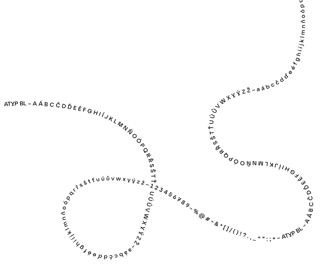
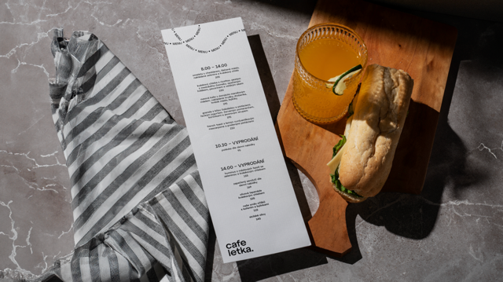
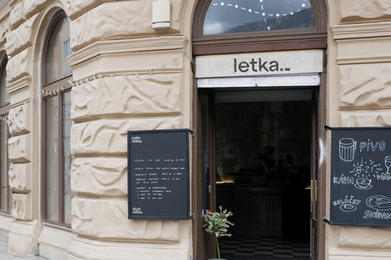

# Café Letka: When Typography Takes Flight  

| Client         | Café Letka / Club Letka                     |
|----------------|---------------------------------------------|
| Year           | 2024                                        |
| My Role        | Art Direction, Concept & Typography         |
| Deliverables   | Visual identity system, packaging, signage, merchandise, social media |

## A Hand-Drawn Plane That Couldn't Fly Forever

Coffee is always a faithful sidekick – so when a café project lands on your desk, you know it’s going to be a good one. Café Letka sits near Prague’s military aviation museum, and above its entrance hangs a charming logo: a hand-drawn aeroplane created by the owner’s daughter.

But this sentimental sketch wasn’t built to keep up with a growing brand. As Letka gained popularity on social media and started drawing both locals and tourists, its identity began to blur – especially with a competitor just a block away tapping into the same aviation theme.

##### 

## What If Letters Could Fly?

The design brief grew more complex on-site. Club Letka, a sister theatre venue under the same roof, had no visual connection to the café—despite shared ownership and clientele. The identities felt disconnected. We needed to unify them without losing their individual character.

So I sat back, sketchbook in hand. One espresso turned into two. Morning hush gave way to evening buzz, and Letka revealed its rhythm.

The breakthrough came not in the café, but at the airport—heading to London for a six-month study stint. Aviation, I realized, doesn’t just live in machines. It lives in motion. In the sky’s invisible patterns. And that’s when I pitched it:

> _“What if the letters could actually move—like tiny planes tracing paths through the sky?”_

##### 

## How Typography Became Our Wingman

The team and I agreed: this concept had wings. The challenge? Finding a typeface that could hold its own mid-flight—something with enough presence to feel dynamic, but refined enough to remain legible.

After rounds of testing, we landed on **Atyp BL** in bold uppercase. It moved, curved, and floated—always clear, never chaotic.

##### 

To amplify the type’s movement, we embraced a strict black-and-white palette for the café. Club Letka’s identity, by contrast, flipped the script: deep theatre shadows lit up with bursts of color and energy.

**TBD Images**

## Design Takes Off: From Sketch to Signage

With the system defined, we moved into applications: cups, menus, bags, aprons, and signage. Every piece was built around our visual language of flying type.

Short slogans like _“Už letím do Letky”_ (“I’m flying to Letka”) created rhythm and recognition. Contrails carried repeated type patterns—_“menu – menu – menu”_—in playful loops. These weren’t just labels; they were motion-filled, accessible brand moments.

##### Café Letka – Logo Update and Visual Applications

###### Brand Application on Interior Doors & Aprons.

###### Brand Application on Menu.

###### Brand Application on Take Away Cups.

###### Brand Application on Beer Coaster.

###### Brand Application on Merchandise – Mugs & Tote Bag. 

###### Brand Application on Social Media – Instagram Stories.

###### Brand Application on the Exterior Doors – Displays the Combined Logo for the Sister Businesses.

## The Client Pivot: A Softer Landing

The final presentation was met with warm praise—_“It’s very well thought out,”_ the owner said—but also a pause.  
In the end, they chose a **simpler, more logo-focused route**. Not quite the landing we envisioned, but one that taught us plenty about letting go.

## Two Lessons from the Letka Flight Path

Though the system didn’t take full flight, the journey shaped how I work:

1. **Remote collaboration sharpened my documentation.** With part of the work done while living abroad, I refined the way I communicate visuals and rationale—ensuring clarity, even across time zones.

2. **Balancing concept with function.** I learned how to sell not just ideas, but the _value_ behind them: how a design system solves problems, not just looks good.

Like the contrails it was built around, this project left a trace—proof that even grounded ideas can fuel future flights.
